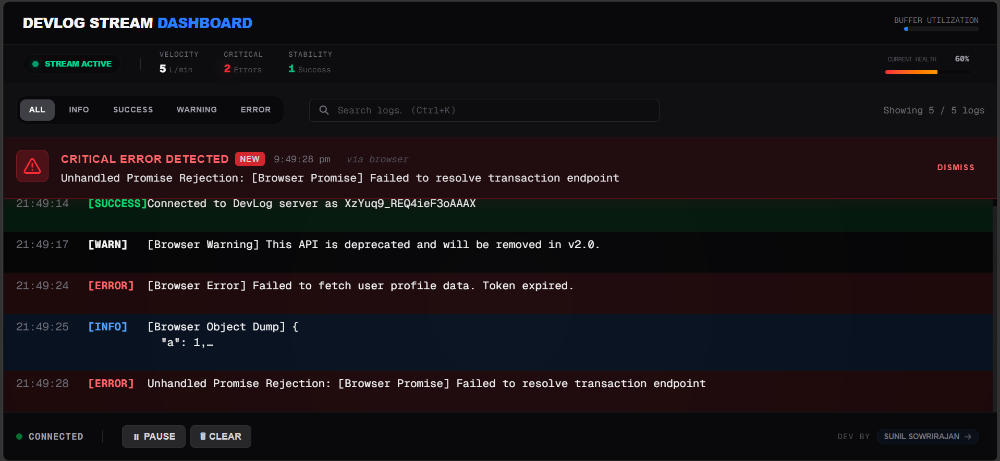
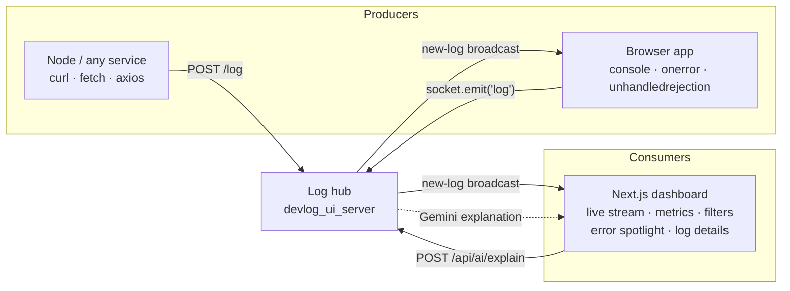

# Devlog Stream

<p align="center">
  
</p>

Real-time log aggregation and monitoring. A lightweight Socket.io hub that ingests logs from any
service (REST, WebSocket, or an in-browser console interceptor) and fans them out to a live
"command center" dashboard, with optional AI-powered root-cause explanations.

This repository contains two independent packages that are run side by side:

| Package | Role | Stack |
| --- | --- | --- |
| [`devlog_ui_server-main/`](./devlog_ui_server-main) | Log hub — ingestion, normalization, broadcast, AI endpoint | Node.js, Express 5, Socket.io 4, `@google/genai`, dotenv |
| [`devlog_ui_client-main/`](./devlog_ui_client-main) | Dashboard UI — live log stream, metrics, filtering, log detail | Next.js 16 (App Router), React 19, TypeScript, Tailwind CSS 4, socket.io-client |


---

## Architecture



- The hub is **stateless and memory-only**. It normalizes, logs to stdout, and rebroadcasts; it
  stores nothing.
- Each dashboard tab keeps its own **100-entry ring buffer**, so every connected client sees the
  same stream from the moment it connects (no replay, no history).
- The **"Ask AI"** button in the log detail modal is a client → server call back to the hub, which
  proxies to `gemini-2.5-flash` and returns Markdown.

---

## Quick Start

Two terminals. Start the hub first.

### 1. Server

```bash
cd devlog_ui_server-main
npm install

# optional: enables the "Ask AI" button
echo "GEMINI_API_KEY=your_key_here" > .env

npm start          # or: npm run dev
# → DevLog Server running on http://localhost:4000
```

### 2. Client

```bash
cd devlog_ui_client-main
npm install

# .env.local
NEXT_PUBLIC_SOCKET_URL=http://localhost:4000
NEXT_PUBLIC_DEVLOG_URL=http://localhost:4000

npm run dev
# → http://localhost:3000
```

Open the dashboard, then hit the built-in playground at
**http://localhost:3000/test-logger** and click a few buttons to see logs stream in.

### Smoke-test from a terminal

```bash
# HTTP ingestion
curl -X POST http://localhost:4000/log \
  -H "Content-Type: application/json" \
  -d '{"type":"error","message":"Database connection failed","source":"auth-service"}'

# AI explanation
curl -X POST http://localhost:4000/api/ai/explain \
  -H "Content-Type: application/json" \
  -d '{"type":"error","message":"ECONNREFUSED 127.0.0.1:5432","source":"db-pool"}'
```

---

## Server Reference

Single-file service: [`server.js`](./devlog_ui_server-main/server.js) (CommonJS, ~100 lines).

### Environment

| Variable | Required | Default | Purpose |
| --- | --- | --- | --- |
| `PORT` | No | `4000` | HTTP + WebSocket port |
| `GEMINI_API_KEY` | For AI only | — | Enables `POST /api/ai/explain`; otherwise that route returns `500` |

### REST API

#### `POST /log`

Ingests a log and broadcasts it to every connected socket client. Responds `202 Accepted`.

```jsonc
{
  "type": "info | success | warning | error",  // default: "info"
  "message": "The log message string",          // default: "Empty log message"
  "source": "auth-service",                     // default: "Unknown"
  "timestamp": "2026-09-29T15:00:00Z"           // default: server ISO-8601 now
}
```

Missing fields are backfilled with defaults by `broadcastLog()`; unknown/extra fields (e.g. a
`details` payload) are **dropped**. The normalized object is echoed back in the response body.

#### `POST /api/ai/explain`

```jsonc
{ "type": "error", "message": "...", "source": "..." }
```

→ `{ "explanation": "## markdown ..." }`

Builds a senior-engineer prompt from the log, calls `gemini-2.5-flash` via `@google/genai`, and
returns Markdown. `500` if `GEMINI_API_KEY` is missing or generation fails.

### WebSocket Events

| Direction | Event | Payload |
| --- | --- | --- |
| Client → Server | `log` | Same shape as the `POST /log` body |
| Server → Client | `new-log` | Normalized `{ type, message, timestamp, source }` |

On every connection the server immediately emits a synthetic `success` log
(`Connected to DevLog server as <socket.id>`), so a fresh dashboard always has at least one entry.

### Other behavior

- CORS is fully open (`origin: "*"`) for both HTTP and WebSocket.
- `EADDRINUSE` is caught and reported explicitly before exiting.
- Connection/disconnection of every socket is written to stdout.

---

## Client Reference

### Routes

| Route | Purpose |
| --- | --- |
| `/` | The live dashboard |
| `/test-logger` | Playground that triggers `console.log/warn/error`, a circular object, an uncaught `throw`, and an unhandled `Promise.reject` — all piped to the hub by the browser logger |

### Environment

| Variable | Used by | Default |
| --- | --- | --- |
| `NEXT_PUBLIC_SOCKET_URL` | Dashboard socket connection (`app/page.tsx`) | `http://localhost:4000` |
| `NEXT_PUBLIC_DEVLOG_URL` | Browser console interceptor (`lib/browserLogger.ts`) | `http://localhost:4000` |

Both are `NEXT_PUBLIC_*`, i.e. inlined into the browser bundle at build time.

### Features

- **Live stats bar** — connection state, *Velocity* (logs/min over a rolling 60s window, repeats
  counted), *Critical* error count, *Stability* success count, and a *Current Health* percentage bar
  (`(total − errors) / total`) with a red→amber gradient when errors are present.
- **Error spotlight** — a sticky red banner that slides in for the newest `error` entry; click to
  open the detail modal, or dismiss it.
- **Type filters + search** — `all / info / success / warning / error` pills, full-text search with
  match highlighting, and a `Showing X / Y logs` counter. `Ctrl+K` / `Cmd+K` focuses search.
- **Deduplication** — consecutive logs with the same `message` + `type` collapse into a single row
  with an `xN` badge; the modal lists every occurrence timestamp.
- **Pause / resume** — incoming logs are diverted into a capped buffer (max 100) and flushed on
  resume, so high-frequency streams don't scroll past unread. The badge shows `+N` pending.
- **Log detail modal** — full timestamp (ms precision), source, occurrence history, copy-to-
  clipboard, and a pretty-printer that re-formats JSON message bodies.
- **Ask AI** — one click posts the message to `/api/ai/explain` and renders the returned Markdown
  inline (loading state included).
- Custom 6px scrollbars and a `.no-scrollbar` utility for horizontal strips.

### The browser logger SDK

[`lib/browserLogger.ts`](./devlog_ui_client-main/lib/browserLogger.ts) is the piece that makes
**browser console output** observable. It is mounted once from the root layout via
`<ClientLoggerInit />` and is guarded by an `isInitialized` flag plus a `typeof window` check, so it
never runs during SSR.

It hooks three things and forwards all of them as `source: 'browser'`:

1. `console.log` / `console.warn` / `console.error` — the originals are always called first, then the
   arguments are serialized.
2. `window.onerror` — uncaught exceptions; returns `false` so the browser's default handler still runs.
3. `window.addEventListener('unhandledrejection')` — rejected promises with no catch.

Serialization is defensive: `Error` objects yield their `stack`, plain objects go through a
`safeStringify` replacer that replaces circular references with `[Circular]` and falls back to
`[Unserializable Object]`, everything else uses `String()`. Emission is wrapped in an `isLogging`
re-entrancy guard and silently no-ops when the socket is disconnected, so it can never crash or
feedback-loop the host app. Reconnection is capped at 5 attempts with a 2s timeout.

To use it in another app, call it once after mount:

```ts
import { initBrowserLogger } from './lib/browserLogger';
useEffect(() => { initBrowserLogger('http://localhost:4000'); }, []);
```

### Source map

```
devlog_ui_client-main/
├── app/
│   ├── layout.tsx              # Geist fonts, mounts <ClientLoggerInit/>
│   ├── page.tsx                # Dashboard: state, filter/search pipeline, layout composition
│   ├── globals.css             # Tailwind 4 import, theme vars, custom scrollbars
│   └── test-logger/page.tsx    # Log-generation playground
├── components/
│   ├── StatsBar.tsx            # Velocity / errors / success / health meter
│   ├── FilterBar.tsx           # Type pills + search input (Ctrl+K)
│   ├── ErrorSpotlight.tsx      # Newest-error banner
│   ├── LogViewer.tsx           # Auto-scrolling list + empty state
│   ├── LogItem.tsx             # One row: time, type, highlight, xN badge, source
│   ├── LogModal.tsx            # Detail modal, copy, JSON pretty-print, Ask AI
│   ├── ControlBar.tsx          # Connection state, pause/resume, clear
│   ├── LogInput.tsx            # Manual message composer (currently unused)
│   └── ClientLoggerInit.tsx    # Mount-once side-effect component
├── hooks/useSocket.ts          # Socket lifecycle, ring buffer, dedup, pause buffer
└── lib/browserLogger.ts        # console/error/rejection interceptor
```

`LogEntry` (defined in `hooks/useSocket.ts`) is the contract shared by every component:
`{ type, message, timestamp, source?, id?, count?, occurrences? }`. `id` is generated client-side
(random 9-char string) and `count` / `occurrences` are added by the dedup logic.

---

## Scripts

| Directory | Command | Does |
| --- | --- | --- |
| `devlog_ui_server-main` | `npm start` / `npm run dev` | `node server.js` (both identical) |
| | `npm test` | Placeholder — exits 1, no test suite exists |
| `devlog_ui_client-main` | `npm run dev` | Next dev server on :3000 |
| | `npm run build` | Production build |
| | `npm start` | Serve the production build |
| | `npm run lint` | ESLint 9 flat config (`core-web-vitals` + `typescript`) |

There is no workspace/monorepo tooling — install and run each directory independently.

---

## Design Notes & Known Gaps

Behavior worth knowing before you build on this:

- **`warn` vs `warning` mismatch.** `browserLogger` emits `type: 'warn'`, but the `LogEntry` union,
  the server README contract, the filter pills, and the color maps all use `'warning'`. The server
  passes `type` through unmodified, so browser warnings render as `[warn]` and never match the
  *Warning* filter or its colors. Renaming the emit to `'warning'` (or normalizing server-side)
  fixes it.
- **`details` is dropped.** `browserLogger` sends stack traces as `details`, but `broadcastLog()`
  reconstructs the payload from only `type/message/timestamp/source`, so uncaught-exception and
  unhandled-rejection stacks never reach the UI. Add `details` to the normalized object and to
  `LogEntry` to surface them in the modal.
- **The AI endpoint URL is hardcoded** in `LogModal.tsx` as `http://localhost:4000/api/ai/explain`,
  ignoring `NEXT_PUBLIC_SOCKET_URL`. It will break on any non-local host.
- **Pause toggles reconnect.** `useSocket`'s effect lists `isPaused` in its dependency array to
  capture the latest state, which means every pause/resume disconnects and recreates the socket —
  the server logs a disconnect/connect pair and the client loses nothing (buffer is a ref), but it
  is wasteful. A `useRef` for the pause flag would avoid the churn.
- **`bufferSize` is read from a ref during render** (`bufferRef.current.length`), so the pending-log
  badge only repaints when some other state change causes a re-render.
- **AI Markdown styling is mostly inert.** `LogModal` uses `prose` / `prose-purple` classes but
  `@tailwindcss/typography` is not a dependency, so only the arbitrary `[&>…]` variants apply.
- **Unused code.** `date-fns` is a declared dependency with no imports; `components/LogInput.tsx`
  is not rendered by any route; `emitLog` and `setLatestError` are destructured in `app/page.tsx`
  but never used. `LogItem`'s inline `isExpanded` occurrence list is technically rendered when a row
  is selected, but the modal opens at the same time and covers it, so that branch of the UI is
  effectively dead.
- **No persistence and no auth.** The hub keeps nothing, has no authentication, and serves CORS
  `origin: "*"` — fine for local development, not for a shared network. Logs vanish on reload, and
  anyone who can reach port 4000 can inject logs.
- **Page metadata is still the scaffold default** ("Create Next App") in `app/layout.tsx`.

---

## Requirements

- **Node.js 20+** recommended (Next.js 16 needs a modern runtime; the server's Express 5 and
  Socket.io 4 need 18+).
- npm (each package ships its own `package-lock.json`).
- Ports **4000** (hub) and **3000** (dashboard) free.
- A Google Gemini API key — only if you want the "Ask AI" feature.

---

## License

Private and for internal use only.

Developed by **[Sunil Sowrirajan](https://www.linkedin.com/in/sunil-sowrirajan-40548826b/)**.
